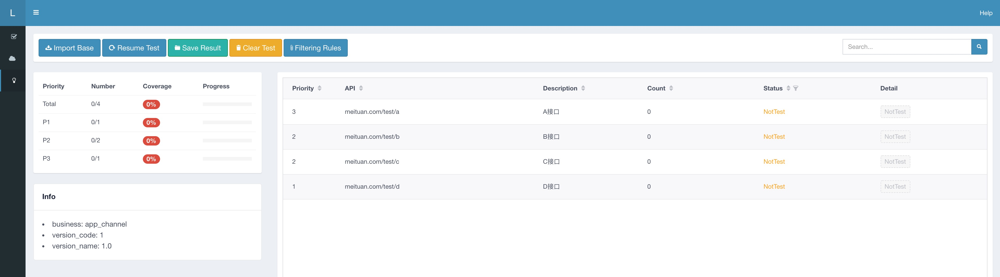
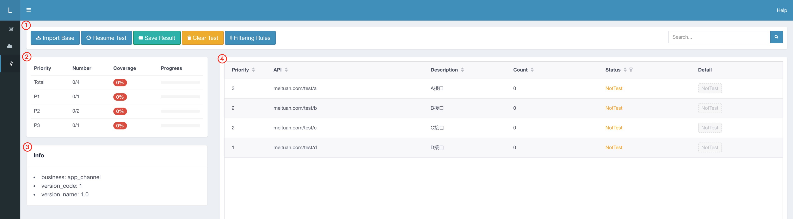

# Lyrebird Plugin API-Coverage

[](https://travis-ci.org/meituan/lyrebird-api-coverage)

## 简介
* API-Coverage是基于[Lyrebird](https://github.com/meituan/lyrebird)的插件，为客户端提供API维度测试覆盖评估方法。 
* 客户端的操作可以实时反应在前端页面上，主要有API覆盖率统计、不同优先级的覆盖率展示等。可以参考该数据，判断测试是否已覆盖目标功能。
* API覆盖率的计算公式：覆盖率 = 已访问API/基准API
    * 已访问API：被测应用已发出的请求（只记录当前业务内API）
    * 基准API：当前业务所有API




## 环境要求

* macOS

* Python3.6及以上


## 安装

``` bash
pip3 install lyrebird-api-coverage
```


## 启动
```bash
lyrebird
```

## 界面说明



如图所示，不同区域的介绍：

1. 工具栏
    1. Import Base - 导入需要统计的基准API列表（文件格式见附录[Base数据格式](#Base数据格式)）
    2. Resume Test - 导入统计结果并继续统计
    3. Save Result - 导出统计结果到“~/.lyrebird/plugin/lyrebird_api_coverage/data/”
    4. Clear Test - 清空当前的统计结果
    5. Filtering Rules - 过滤规则设置（配置格式见附录[过滤配置数据格式](#过滤配置数据格式)）
  
2. 覆盖率信息

    1. 展示覆盖率信息，总体覆盖率信息，分优先级覆盖率信息

3. 基准API信息
    1. 展示当前生效的基准API信息

4. 覆盖率详情模块

    1. Priority：API的优先级
    2. API: URL信息
    3. Description：API的描述信息
    4. Count：API的请求次数
    5. Status：API的状态，包括 已测试，未测试，不在base中的API
    6. Detail：查看请求详情，点击表格最后一列的详情中的Detail，就可以展示最近一次的请求的详情

## 使用流程

1. 准备Base数据，Base数据格式[见附录](#Base数据格式)
2. 点击工具栏中的“Import Base”按钮进行导入Base文件
3. 操作过程中观测页面的覆盖率等信息展示


## 开发者指南

```bash
# clone 代码
git clone https://github.com/meituan/lyrebird-api-coverage.git

# 进入工程目录
cd lyrebird-api-coverage

# 创建虚拟环境
python3 -m venv venv

# 安装依赖
source venv/bin/activate
pip3 install -r requirements.txt

# 使用IDE打开工程（推荐Pycharm或vscode）

# 在IDE中执行debug.py即可开始调试
```


## 附录
### Base数据格式

```json
{
  "business": "app_channel",
  "version_code": 1,
  "version_name": "1.0",
  "api_list": [
    {
      "desc": "A接口",
      "priority": 3,
      "url": "meituan.com/test/a"
    },
    {
      "desc": "B接口",
      "priority": 2,
      "url": "meituan.com/test/b?paramKey=val"
    },
    {
      "desc": "C接口",
      "priority": 2,
      "url": "meituan.com/test/c/{num}"
    },
    {
      "desc": "D接口",
      "priority": 1,
      "url": "meituan.com/test/d?sourceType=1"
    }
  ]
}
```
- 支持两种API，Path 和 Path + query，即不带参数的配置和带参数的配置
- 在配置API时，如果path中带有参数，如 a.b.com/v1/test/{num}，需要用'{}'括起，在覆盖率计算中用来判断是同一API
- 配置参数的情况下，字段名的大小写敏感

### 过滤配置数据格式
- demo

```json
{
  "exclude": {
    "host": [
      "a.meituan.com",
      "b.baidu.com"
    ],
    "regular": [
      ".webp",
      ".gif",
      ".jpg",
      ".png"
    ]
  }
}
```
- 支持两种筛除规则，以host为维度，以包含字符串为维度
    - 如果不想关注某些host下的请求，可以按照上述筛选配置文件的数据格式配置 host字段下的规则
    - 如果不想关注某些包含指定字符串的请求（如：.webp），可以按照上述筛选配置文件的数据格式配置 regular字段下的规则
    
- 字段说明
    - exclude:不关注的配置项
        - host:不关注的host
        - regular:不关注的字符串（URL只要包含指定的字符串都会筛选掉）

